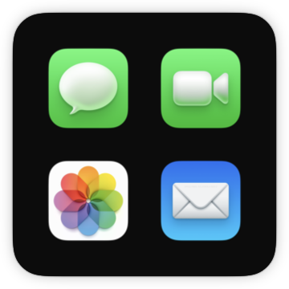
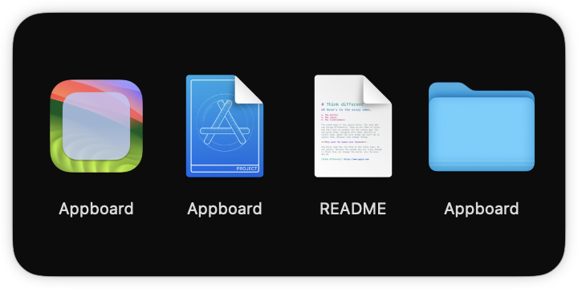

# Appboard

Apps as widgets on your desktop 

## About

Appboard allows you to put apps and other things on the Desktop or Notification Center via a widget. Just add a widget, right click, "Edit Appboard", and add paths to applications, files, or folders.

> **Note:** It _must_ be run from the Applications folder

## Why?

I personally prefer to have desktop icons hidden (with `defaults write com.apple.finder CreateDesktop false`), but I'd still like to have easy access to some apps without adding more things to my already-overflowing dock.

## How it Works

First, the widget receives a list of paths from a configuration intent. Then, it gets icons for those apps/folders/files/etc. using `NSWorkspace.shared.icon(forFile:)`, falling back to a red square if it can't find it. It lays the icons out in a simple grid with links to the Appboard URL scheme.

The main Appboard app has a URL scheme that accepts URLs of the form `appboard://open?path=<path>`. This is required because widgets cannot open URLs other than those for which their parent applications are editors.

When the Appboard app is opened, it checks for an Appboard link. If there is one, it opens the path and immediately terminates. If not, it opens a help screen.

## Images

